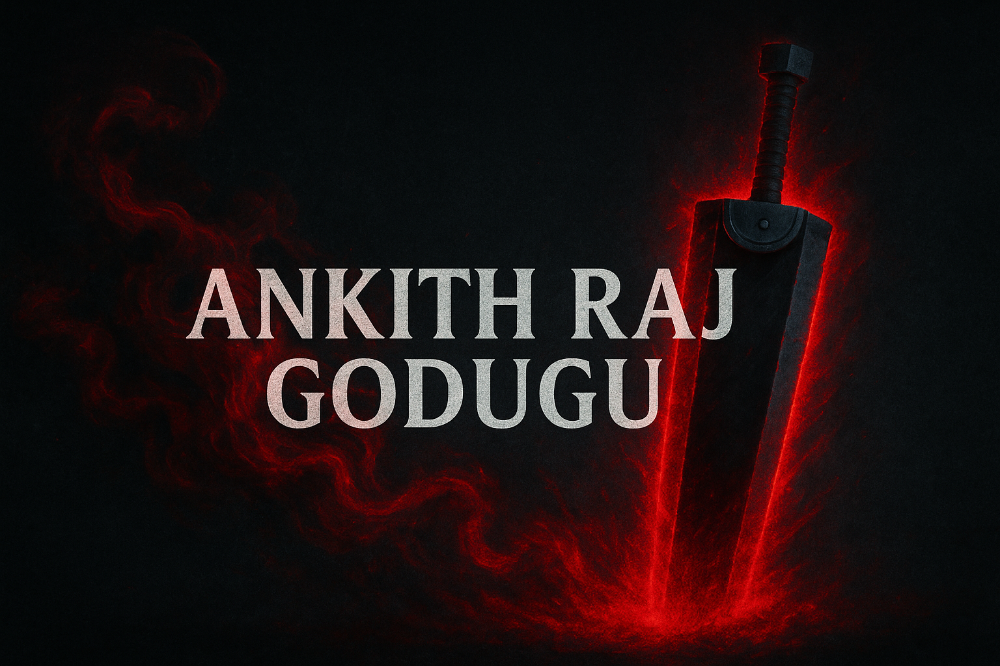

# ⚔️ Ankith Raj Godugu — Portfolio  



A dark-themed, anime-inspired portfolio website built with **React + TypeScript + Vite**.  
This project blends modern web design with **Berserk-inspired aesthetics**, featuring animated elements like the *Brand of Sacrifice cursor* and *Guts’ Dragonslayer sword*.  

---

## 🚀 Tech Stack

| Category | Technology |
|-----------|-------------|
| ⚙️ **Frontend Framework** | React (with TypeScript + Vite) |
| 🎨 **Styling** | Tailwind CSS + Custom Animations |
| 🧠 **Routing** | React Router DOM |
| 🌌 **Meta Management** | React Helmet Async |
| 🧩 **Icons & UI** | Lucide Icons + Custom assets |
| 🔥 **Hosting** | Vercel (with Custom Domain) |

---

## 🖥️ Features

- ⚔️ **Custom Animated Cursors**  
  - *Guts’ Dragonslayer sword* follows your mouse  
  - *Brand of Sacrifice* glows and pulses when clicked  

- 🌫️ **Aurora Particle Background**  
  Dynamic parallax gradients with floating particles  

- 🧱 **Modular Components**  
  Pages for Home, Projects, Skills, About, and Contact  

- 🌐 **Responsive Layout**  
  Perfectly adapts to mobile, tablet, and desktop  

- 🧠 **SEO Ready**  
  Meta tags managed by React Helmet for better indexing  

- 🎭 **Dark Fantasy Theme**  
  Blends deep crimson, blue, and gold tones inspired by *Berserk*  

---

## 🧩 Installation & Setup
# Clone this repository
git clone https://github.com/AnkithRajGodugu/portfolio-m.git

# Move into project directory
cd portfolio-m

# Install dependencies
npm install

# Start the development server
npm run dev


Then open your browser at http://localhost:5173/

## ☁️ Deployment

This portfolio is deployed using Vercel
 for fast, secure, and automatic CI/CD builds from GitHub.

Environment	URL
🧪 Preview (Vercel)	https://portfolio-8lm2a8kr1-ankithrajgodugus-projects.vercel.app

🌐 Production (Custom Domain)	https://portfolio.ankithtech.xyz

🔄 Automatic Deployment:
Every push to the main branch triggers a new Vercel build and deployment automatically.

⚙️ Vercel Configuration Includes:

React + TypeScript build using Vite

Global CDN and HTTPS by default

GitHub integration for instant updates

Optimized caching and compression


	
## 🎨 Cursor Effects
Cursor	Description
🩸 Brand of Sacrifice	Pulsing red glow with dripping blood animation. Vibrates when clicked to simulate a curse trigger.
⚔️ Guts’ Dragonslayer Sword	Tracks mouse movement with a sweeping animation and anti-magic visual effect.
🔧 Future Enhancements

🌪️ Add environment-based lighting effects

🧬 Integrate backend contact form via Node/Express

💾 Add motion-based project preview cards

🕹️ Optional theme toggle between Light / Berserk Mode

## 🧠 Author

👤 Ankith Raj Godugu
💼 DevOps & Cloud Enthusiast | Full Stack Developer
🌐 Portfolio

📧 ankithrajgodugu@gmail.com

🐙 GitHub
 | 🔗 LinkedIn

## 📜 License

This project is licensed under the MIT License — free to use, modify, and share.

 ✨ “The smell of steel and ambition — code forged like a sword.”

---


## 📁 Project Structure

```bash
portfolio-m/
├── src/
│   ├── components/
│   │   ├── Home.tsx
│   │   ├── Projects.tsx
│   │   ├── Skills.tsx
│   │   ├── About.tsx
│   │   ├── Contact.tsx
│   │   └── CustomCursor.tsx
│   ├── assets/
│   │   ├── brand-cursor.png
│   │   ├── guts-sword.png
│   │   └── my-icon.png
│   ├── App.tsx
│   ├── App.css
│   └── main.tsx
├── package.json
├── vite.config.ts
└── README.md

---


